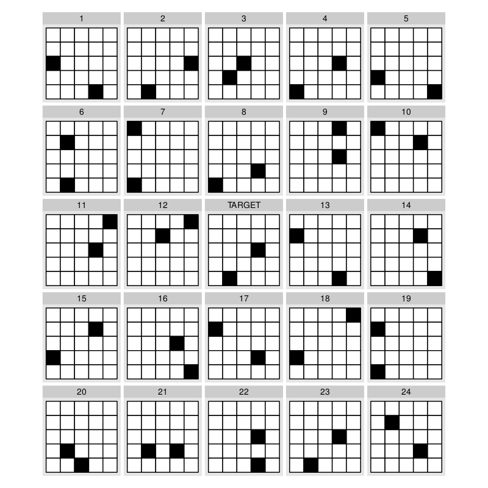
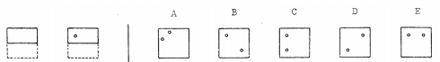

```{r sineillusion-setup, fig.keep='all', cache=FALSE, echo=FALSE, include=FALSE, eval=TRUE}
require(knitr)
rm(list=ls())
wd <- getwd()
opts_chunk$set(cache.path='cache/', fig.align='center', fig.width=6, fig.height=6, fig.show='hold', par=TRUE, cache=TRUE, concordance=TRUE, autodep=TRUE, root.dir="../", fig.path='Prelim-figure/', message=FALSE, warning=FALSE)
datadir <- "../Data/sineIllusion/"
codedir <- "../Code/sineIllusion/"
options(replace.assign=TRUE,width=70,scipen=3)
require(knitr)
library(reshape2)
suppressMessages(library(ggplot2))
library(plyr)
suppressMessages(library(gridExtra))

source(paste(codedir, "functions.r", sep=""))

f <- function(x) 2*sin(x)
fprime <- function(x) 2*cos(x)
f2prime <- function(x) -2*sin(x)

```


# Academic Background
- Undergrad: Psychology & Applied Math at Texas A&M
- Bioinformatics at Iowa State (started in 2009)
- Transferred to Statistics in Fall 2010
- Finished classes in Spring 2013

# Outline
- Sine Illusion
- Visual Aptitude and Graphical Inference
- Salience of Graph Features

# Signs of the Sine Illusion - Why we need to care
```{r original,echo=FALSE, fig.width=6.125, fig.height=5, out.width='45%', out.height='auto'}
qplot(x=x, xend=xend, y = ystart, yend=yend, geom="segment", data=createSine(40, 1, f=f, fprime=fprime, f2prime)) +
  theme(panel.grid.major=element_blank(), panel.background = element_rect(fill = "white", 
                colour = "black"), plot.margin = unit(c(0,0,-0.5,-0.5), "cm"), 
       panel.grid.minor=element_blank(), panel.background=element_blank(),
       axis.title = element_blank(), axis.ticks = element_blank(), 
       axis.text = element_blank()) + coord_equal(ratio=1)
```

# Example of the Sine Illusion
8-hour Average Ozone Levels in Houston, TX by temperature at Hobby Airport

```{r example-sineillusion, echo=FALSE, results='asis', fig.width=10, fig.height=4}
datasub <- read.csv(paste(datadir, "Ozone-subset.csv", sep=""))
nsite <- length(unique(datasub$SiteID))
a <- qplot(data=datasub, x=jitter(Tmax), y=Ozone, geom="point", shape=I(1), colour=I("grey40"), alpha=I(.5), xlab="Temperature (F)", ylab="8-hour Average Ozone Concentration (ppm)") + geom_line(aes(x=Tmax, y=fit), size=1.25, colour="black") + theme_bw()
b <- qplot(data=datasub, x=jitter(Tmax), y=resid, geom="point", shape=I(1), colour=I("grey40"), alpha=I(.5), xlab="Temperature (F)", ylab="Residual Ozone Concentration (ppm)") + geom_line(aes(x=Tmax, y=0*resid), size=1.25, colour="black") + theme_bw()

grid.arrange(a, b, ncol=2)
```

# Explaining the Illusion

---

The sine illusion results from misapplication of a three-dimensional visual heuristic to ambiguous two-dimensional images
```{r ribbon-illusion, echo=F, fig.width=8, fig.height=6, out.width='60%', fig.cap='Perspective plot of a three-dimensional image similar to the sine illusion'}

f <- function(x) 2*sin(x)
fprime <- function(x) 2*cos(x)
f2prime <- function(x) -2*sin(x)

x <- seq(0, 2*pi, length=42)[2:41]
data <- do.call("rbind", lapply(seq(-.5, .5, 1), function(i) data.frame(x=x, y=2*sin(x), z=i)))

data.persp <- acast(data, x~z, value.var="y")
x <- sort(unique(data$x))
y <- sort(unique(data$y))
z <- sort(unique(data$z))

usr <- par("usr")
par(mar=c(0, 0, 0, 0))
persp(x, z, data.persp,  xlab="", ylab="", zlab="", theta=0, phi=45, border="black", shade=.35, col="white", xlim=c(-pi/12, 2*pi+pi/12), ylim=c(-1.75, 1.75), scale=FALSE, box=FALSE, expand=3/pi, d=3) # , ltheta=0, lphi=-15
```

---

The sine illusion results from misapplication of a three-dimensional visual heuristic to ambiguous two-dimensional images
```{r ribbon-illusion2, echo=F, fig.width=8, fig.height=6, out.width='60%', fig.cap='Perspective plot of the same data, with a vanishing point closer to infinity'}
usr <- par("usr")
par(mar=c(0, 0, 0, 0))
persp(x, z, data.persp,  xlab="", ylab="", zlab="", theta=0, phi=45, border="black", shade=.35, col="white", xlim=c(-pi/12, 2*pi+pi/12), ylim=c(-1.75, 1.75), scale=FALSE, box=FALSE, expand=3/pi, d=50) # , ltheta=0, lphi=-15
```

In this figure, the vanishing point has been moved towards infinity; the lines are straight and closer to the appearance of the sine illusion

---

## Context

The illusion doesn't disappear with grid lines, but does disappear when the context is removed. 

```{r originalgrid, echo=F, fig.width=7.5, fig.height=6, out.width='40%'}
f <- function(x) 2*sin(x)
fprime <- function(x) 2*cos(x)
f2prime <- function(x) -2*sin(x)

dframe <- createSine(n = 40, len = 1, f=f, fprime=fprime, f2prime)
require(grid)
qplot(x=x, xend=xend, y = ystart*ell, yend=yend*ell, geom="segment", data=dframe) +
  theme(panel.grid.major.y=element_line(colour="grey75"), 
        panel.grid.minor.y=element_line(colour="grey85"), 
        panel.grid.major.x=element_blank(),
        panel.background = element_rect(fill = "white", 
                colour = "black"),
       panel.grid.minor.x=element_blank(), panel.background=element_blank(),
       axis.title = element_blank(), axis.ticks = element_blank(), 
       axis.text = element_blank(), 
        plot.margin = unit(c(0,-.5,-.5,-1), "cm")) + coord_equal(ratio=1) + 
  geom_segment(size=2, data=dframe[c(31, 38),]) 
```

<small>
Cleveland and McGill (1984) demonstrated that we can compare the length of two lines accurately; Day and Stecher (1991) showed that the illusion persists if there is curvature in the underlying function. 
</small>

---

## Geometry of the Sine Illusion

```{r illusion-geometry, fig.width=7.2, fig.height=5.85, out.width='75%', out.height='auto', echo=F}
f <- function(x) 2*sin(x)
fprime <- function(x) 2*cos(x)
f2prime <- function(x) -2*sin(x)
library(plyr)
dframe <- createSine(n = 150, len = 1, f=f, fprime=fprime, f2prime=f2prime)
dframe$ystartcts <- dframe$ystart
dframe$yendcts <- dframe$yend
dframe[1:150,c(2, 3, 5, 6)] <- NA
dframe[(1:15)*10-5, c(2, 3)] <- dframe[(1:15)*10-5, 1] 
dframe[(1:15)*10-5, 5] <- dframe[(1:15)*10-5, 4] - .5
dframe[(1:15)*10-5, 6] <- dframe[(1:15)*10-5, 4] + .5
dframe$type <- "Vertical Width"

idx <- which(!is.na(dframe$xstart))
dframe$ell <- dframe$ell/2
dframe.1 <- getSecantSegment(dframe$xstart[idx], dframe, f, fprime, f2prime)
dframe.1$x <- dframe$x[idx]
dframe.1$y <- dframe$y[idx]
dframe.1$ystartcts <- dframe$ystartcts[idx]
dframe.1$yendcts <- dframe$yendcts[idx]
names(dframe.1) <- c("x", "y", "deriv", "xstart", "xend", "ystart", "yend", "ell", "ell.quad1", "ell.quad2", "type", "a", "ystartcts", "yendcts")
dframe.1$vangle <- with(dframe.1, atan(deriv))
dframe <- rbind.fill(dframe, dframe.1)
dframe$type <- factor(dframe$type)

p1 <- qplot(x=x, y=y, geom="line", data=dframe, colour=I("grey50")) + theme_bw() + 
  geom_line(aes(y=ystartcts), colour="grey50", linetype=4) + 
  geom_line(aes(y=yendcts), colour="grey50", linetype=4) +
  geom_segment(data=subset(dframe, !is.na(type)), 
               aes(x=xstart, xend = xend, y=ystart, yend=yend, colour=type, linetype=type), size=0.8)  + 
  xlab("") + ylab("")  +
  coord_equal(ratio=1) + scale_colour_manual("", values=c("blue", "grey30")) + 
  geom_text(aes(label=paste("theta", "%~~%", round(abs(vangle)/pi*180), "^o", sep=""), 
                x=pmax(xstart, xend)/2+x/2+.35 , y=y-sign(vangle)*.6+.02), colour="blue",
            data=dframe.1, parse=TRUE, hjust=.9, vjust=.5, size=3) + 
  scale_x_continuous(breaks=seq(0, 2*pi, by=pi/2), 
                     labels=c("0", expression(paste(pi,"/2")), expression(pi), 
                              expression(paste("3",pi, "/2")), expression(paste("2",pi)))) +
  scale_linetype_manual("", values=c(1,2)) + 
  theme(legend.key.width = unit(3, "line"), plot.margin = unit(c(0,0,0,0), "cm"), legend.position=c(.25, .2)) 

f <- function(x) 2*sin(x)
fprime <- function(x) 2*cos(x)
f2prime <- function(x) -2*sin(x)
library(plyr)
dframe <- createSine(n = 150, len = 1, f=f, fprime=fprime, f2prime=f2prime)
dframe$ystartcts <- dframe$ystart
dframe$yendcts <- dframe$yend
dframe[1:150,c(2, 3, 5, 6)] <- NA
dframe[(1:15)*10-5, c(2, 3)] <- dframe[(1:15)*10-5, 1] 
dframe[(1:15)*10-5, 5] <- dframe[(1:15)*10-5, 4] - .5
dframe[(1:15)*10-5, 6] <- dframe[(1:15)*10-5, 4] + .5
dframe$type <- "Vertical Width"

asp <- 2
idx <- which(!is.na(dframe$xstart))
dframe$ell <- dframe$ell/2
dframe.1 <- getSecantSegment(dframe$xstart[idx], dframe, f, fprime, f2prime)
dframe.1$x <- dframe$x[idx]
dframe.1$y <- dframe$y[idx]
dframe.1$ystartcts <- dframe$ystartcts[idx]
dframe.1$yendcts <- dframe$yendcts[idx]
names(dframe.1) <- c("x", "y", "deriv", "xstart", "xend", "ystart", "yend", "ell", "ell.quad1", "ell.quad2", "type", "a", "ystartcts", "yendcts")
dframe.1$vangle <- with(dframe.1, atan(deriv*1/asp))
dframe <- rbind.fill(dframe, dframe.1)
dframe$type <- factor(dframe$type)

p2 <- qplot(x=x, y=y, geom="line", data=dframe, colour=I("grey50")) + theme_bw() + 
  geom_line(aes(y=ystartcts), colour="grey50", linetype=4) + 
  geom_line(aes(y=yendcts), colour="grey50", linetype=4) +
  geom_segment(data=subset(dframe, !is.na(type)), 
               aes(x=xstart, xend = xend, y=ystart, yend=yend, colour=type, linetype=type), size=0.8)  + 
  xlab("") + ylab("")  +
  coord_equal(ratio=2) + scale_colour_manual("",guide="none", values=c("blue", "grey30")) + 
  geom_text(aes(label=paste("theta", "%~~%", round(abs(vangle)/pi*180), "^o", sep=""), 
                x=pmax(xstart, xend)/2+x/2+.65 + 
                  c(.35, .35, .15, -.15, .3, .3, .3, .3, .3, .3, 0, -.05, .35, .35, .35) , 
                y=y-sign(vangle)*.35+.17 + 
                  c(0, -.05, -.2, .8, -.05, -0.15, -.2, -.2, -.2, -.2, 0, -.4, -.05, -0.01, 0)), colour="blue",
            data=dframe.1, parse=TRUE, hjust=.9, vjust=.5, size=3) + 
  scale_x_continuous(breaks=seq(0, 2*pi, by=pi/2), 
                     labels=c("0", expression(paste(pi,"/2")), expression(pi), 
                              expression(paste("3",pi, "/2")), expression(paste("2",pi)))) +
  scale_linetype_manual("", values=c(1,2), guide="none") + 
  theme(legend.key.width = unit(3, "line"), plot.margin = unit(c(0,0,0,0), "cm"), axis.text.y=element_blank()) 

p1
```

---

## Geometry of the Sine Illusion

- We perceive the orthogonal width of the implied surface
- The orthogonal width is a function of the x and y range as well as the aspect ratio of the plot. 
- The perceived orthogonal width is also a function of the slope of the line tangent to the underlying function curve. 

# Correcting the Illusion

1. Remove the underlying function (plot the curve and the residuals separately)
2. Change the plotted line length (or spread) so that the **perceived** orthogonal width corresponds to the **original** (data) line length
3. Reparameterize the x-axis in terms of the slope, so that the absolute slope doesn't change

---

## Trend Removal
```{r cleveland,echo=F,fig.width=6, fig.height=6}
f <- function(x) -x^2
sdf <- function(x) (4-0.5*x)/5
  
x <- seq(-2,2.5, by=0.1)

id <- 1:30
dframe <- expand.grid(x=x, id=id)
dframe$y <- with(dframe, rnorm(n=nrow(dframe), mean=f(x), sd=sdf(x)/2))
qplot(x,y, data=dframe, geom="jitter") + theme_bw()
```

---

## Trend Removal
```{r cleveland2,echo=F,fig.width=12, fig.height=6}
dframe$Trend <- f(dframe$x)
dframe$Residuals <- dframe$y - dframe$Trend

x <- seq(-2,2.5, by=0.01)
p1 <- qplot(x=x, y=f(x), ylab="Trend", geom="line") + theme_bw()
p2 <- qplot(x=x, y=Residuals, data=dframe, geom="jitter") + theme_bw()
p <- grid.arrange(p1, p2, nrow=1)
# p
```

---

## X-axis Transformation

Let $a$ and $b$ be the minimum and maximum of the $x$-range under consideration. 

For any value $x \in (a,b)$ the following transformation results in a function with constant absolute slope:    
    
    
<small>
$$
(f \circ T)(x) = a + (b-a)\left(\int_{a}^x |f^\prime(z)| dz\right)\left/\left(\int_{a}^{b}|f^\prime(z)| dz\right)\right.
$$
</small>

---

## X-axis Transformation
```{r xaxisdemo,echo=F, fig.width=10, fig.height=3.75, out.width='100%'}
correctx <- function(z, fprime, a=0, b=2*pi, w=1) {
  # w = 1/(shrink+1)
  const <- integrate(function(x) abs(fprime(x)), a, b)$value
  trans <- sapply(z, function(i) integrate(function(x) abs(fprime(x)), a, i)$value*(b-a)/const + a)
  # alternatively to the rowMeans, you could report back  
  # trans*(1-w) + z*w
  trans*w + z*(1-w)
}
f <- sin
fprime <- cos
f2prime <- function(x) -sin(x)
dframe <- createSine(40 , len=1, f=f, fprime=fprime, f2prime=f2prime)
minor.axis.correction <- correctx(seq(0, 2*pi, pi/8), fprime)

dframe$xtrans <- correctx(dframe$x, fprime=fprime)

dots.orig <- data.frame(x = rep(seq(0, 2*pi, pi/8), times=1), 
                        y=rep(c(-2), each=length(seq(0, 2*pi, pi/8))))
dots <- data.frame(x = rep(minor.axis.correction, times=1), y=rep(c(-2), each=length(minor.axis.correction)))

none <- ggplot(aes(x=x, xend=x, y = ystart, yend=yend), data=dframe) +
  geom_abline(aes(slope = 0, intercept=0), colour="grey70") +
  geom_segment(colour="grey20") +
  theme_bw() + coord_fixed(ratio=1) + xlab("x") + ylab("y")+ 
  scale_x_continuous(breaks=seq(0, 2*pi, by=pi/2), minor_breaks=seq(0, 2*pi, pi/8),
                     labels=c("0", expression(paste(pi,"/2")), expression(pi), expression(paste("3",pi, "/2")), expression(paste("2",pi)))) + 
  geom_point(data=dots.orig, aes(x=x, y=y), inherit.aes=FALSE) + 
  theme(plot.margin = unit(c(.1,.1,-.5,.1), "cm")) + ggtitle("No correction")


full <- ggplot(aes(x=xtrans, xend=xtrans, y = ystart, yend=yend), data=dframe) +
  geom_abline(aes(slope = 0, intercept=0), colour="grey70") +
  geom_segment(colour="grey20") +
  theme_bw() + coord_fixed(ratio=1) + xlab("x") + ylab("y")+ 
  scale_x_continuous(breaks=seq(0, 2*pi, by=pi/2), minor_breaks=minor.axis.correction,
                     labels=c("0", expression(paste(pi,"/2")), expression(pi), expression(paste("3",pi, "/2")), expression(paste("2",pi)))) + 
  geom_point(data=dots, aes(x=x, y=y), inherit.aes=FALSE) + 
  theme(plot.margin = unit(c(.1,.1,-.5,.1), "cm")) + ggtitle("Fully Corrected")
grid.arrange(none, full, nrow=1)
```

---

## Partial Transformations
Shrinkage factor $w \in (0,1)$: allows a less extreme approach to counteracting the illusion

$$(f \circ T_w)(x) = (1-w) \cdot x + w \cdot (f \circ T)(x)$$

<br></br>

- $w=1$ is a full transformation
- smaller values of $w$ indicate a less severe adjustment against the sine illusion
- Under  weaker transformations, the data more closely reflect the original function $f(x)$. 

---

## X-axis Transformation
```{r xaxisdemoweight,echo=F,fig.width=12.5, fig.height=8.25, out.width='90%'}
correctx <- function(z, fprime, a=0, b=2*pi, w=1) {
  # w = 1/(shrink+1)
  const <- integrate(function(x) abs(fprime(x)), a, b)$value
  trans <- sapply(z, function(i) integrate(function(x) abs(fprime(x)), a, i)$value*(b-a)/const + a)
  # alternatively to the rowMeans, you could report back  
  # trans*(1-w) + z*w
  trans*w + z*(1-w)
}
f <- sin
fprime <- cos
f2prime <- function(x) -sin(x)
dframe <- createSine(40 , len=1, f=f, fprime=fprime, f2prime=f2prime)
minor.axis.correction <- correctx(seq(0, 2*pi, pi/8), fprime)

dframe$xtrans <- correctx(dframe$x, fprime=fprime)

dots <- data.frame(x = rep(minor.axis.correction, times=1), y=rep(c(-2), each=length(minor.axis.correction)))

p1 <- ggplot(aes(x=xtrans, xend=xtrans, y = ystart, yend=yend), data=dframe) +
  geom_abline(aes(slope = 0, intercept=0), colour="grey70") +
  geom_segment(colour="grey20") +
  theme_bw() + coord_fixed(ratio=1) + xlab("x") + ylab("y")+ 
  scale_x_continuous(breaks=seq(0, 2*pi, by=pi/2), minor_breaks=minor.axis.correction,
                     labels=c("0", expression(paste(pi,"/2")), expression(pi), expression(paste("3",pi, "/2")), expression(paste("2",pi)))) + 
  geom_point(data=dots, aes(x=x, y=y), inherit.aes=FALSE) + 
  theme(plot.margin = unit(c(.1,.1,-.5,.1), "cm")) + 
  ggtitle("100% Corrected")

dots$x2 <- correctx(seq(0, 2*pi, pi/8), fprime, w=.5)

dframe$xtrans2 <- correctx(dframe$x, fprime=fprime, w=.5)

p2 <- ggplot(aes(x=xtrans2, xend=xtrans2, y = ystart, yend=yend), data=dframe) +
  geom_abline(aes(slope = 0, intercept=0), colour="grey70") +
  geom_segment(colour="grey20") +
  theme_bw() + coord_fixed(ratio=1) + 
  xlab("x") + ylab("y")+ 
  scale_x_continuous(breaks=seq(0, 2*pi, by=pi/2), minor_breaks=minor.axis.correction,
                     labels=c("0", expression(paste(pi,"/2")), expression(pi), expression(paste("3",pi, "/2")), expression(paste("2",pi)))) + 
  geom_point(data=dots, aes(x=x2, y=y), inherit.aes=FALSE)  + 
  theme(plot.margin = unit(c(.1,.1,-.5,.1), "cm")) + 
  ggtitle("50% Corrected")

dots$x3 <- correctx(seq(0, 2*pi, pi/8), fprime, w=1/3)

dframe$xtrans3 <- correctx(dframe$x, fprime=fprime, w=1/3)

p3 <- ggplot(aes(x=xtrans3, xend=xtrans3, y = ystart, yend=yend), data=dframe) +
  geom_abline(aes(slope = 0, intercept=0), colour="grey70") +
  geom_segment(colour="grey20") +
  theme_bw() + coord_fixed(ratio=1) + 
  xlab("x") + ylab("y")+  
  scale_x_continuous(breaks=seq(0, 2*pi, by=pi/2), minor_breaks=minor.axis.correction,
                     labels=c("0", expression(paste(pi,"/2")), expression(pi), expression(paste("3",pi, "/2")), expression(paste("2",pi))))+ 
  geom_point(data=dots, aes(x=x3, y=y), inherit.aes=FALSE) + 
  theme(plot.margin = unit(c(.1,.1,-.5,.1), "cm")) + 
  ggtitle("33% Corrected")

dots$x4 <- correctx(seq(0, 2*pi, pi/8), fprime, w=1/4)

dframe$xtrans4 <- correctx(dframe$x, fprime=fprime, w=1/4)

p4 <- ggplot(aes(x=xtrans4, xend=xtrans4, y = ystart, yend=yend), data=dframe) +
  geom_abline(aes(slope = 0, intercept=0), colour="grey70") +
  geom_segment(colour="grey20") +
  theme_bw() + coord_fixed(ratio=1) + 
  xlab("x") + ylab("y") +
  scale_x_continuous(breaks=seq(0, 2*pi, by=pi/2), minor_breaks=minor.axis.correction,
                     labels=c("0", expression(paste(pi,"/2")), expression(pi), expression(paste("3",pi, "/2")), expression(paste("2",pi))))+ 
  geom_point(data=dots, aes(x=x4, y=y), inherit.aes=FALSE) + 
  theme(plot.margin = unit(c(.1,.1,-.5,.1), "cm")) + 
  ggtitle("25% Corrected")

grid.arrange(p1, p2, p3, p4, nrow=2)
```

---

## Y-axis Transformation
```{r y-generalcorrectioncartoon, echo=F, fig.width=7, fig.height=6, out.width='50%'}
f <- function(x) 2*sin(x)
fprime <- function(x) 2*cos(x)
f2prime <- function(x) -2*sin(x)
df <- createSine(40 , len=1, f=f, fprime=fprime, f2prime=f2prime)[5:16,]
df2 <- createSine(40 , len=.5, f=f, fprime=fprime, f2prime=f2prime)[5:16,]

a <- 9
df.real <- data.frame(x=seq(df$x[1], df$x[12], by=.001))
df.real$y <- f(df.real$x)
df.real$yupper <- df.real$y+.5
df.real$ylower <- df.real$y-.5
dfsec <- getSecantSegment(df$x[a], df2, f, fprime, f2prime)
dfslope <- data.frame(xstart=df$x[a]+.5, xend=df$x[a]-.9, ystart=fprime(df$x[a])*.5+df$y[a], yend=-.9*fprime(df$x[a])+df$y[a])
dfslope2 <- data.frame(xstart=df$x[a]+.5, xend=df$x[a]-.3, ystart=fprime(df$x[a])*.5+df$y[a]+.5, yend=-.3*fprime(df$x[a])+df$y[a]+.5)
qplot(data=df.real, x=x, y=y, geom="line") + 
  theme(panel.grid.major=element_blank(), 
        panel.grid.minor=element_blank(), panel.background=element_blank(),
        axis.title = element_blank(), axis.ticks = element_blank(), 
        axis.text = element_blank()) +  
  geom_line(data=df.real,aes(y=yupper), linetype=3) + 
  geom_line(data=df.real,aes(y=ylower), linetype=4) + 
  geom_segment(data=df, aes(x=xstart, y=ystart, xend=xend, yend=yend), colour="grey50") + 
  geom_segment(data=df[a,], aes(x=xstart, y=ystart, xend=xend, yend=yend), colour="black", size=1.5)+
  geom_segment(data=dfsec, aes(x=sec.xstart, xend=sec.xend, y=sec.ystart, yend=sec.yend)) + 
  geom_point(data=dfsec, aes(x=sec.xstart, y=sec.ystart)) + geom_point(data=dfsec, aes(x=sec.xend, y=sec.yend)) +
  geom_segment(data=dfslope, aes(x=xstart, y=ystart, xend=xend, yend=yend), linetype=2) + 
  geom_text(data=dfsec, aes(x=sec.xstart, y=sec.ystart+.05, label="paste(group('(',list(x[2],y[2]),')'))"), parse=TRUE, hjust=.25) + 
  geom_text(data=dfsec, aes(x=sec.xend, y=sec.yend-.08, label="paste(group('(',list(x[1],y[1]),')'))"), parse=TRUE, hjust=.75) +   
  geom_text(data=dfslope, aes(x=xend+.1, y=yend+.1, label="slope: paste(f, \"'\", (x))"), parse=TRUE, hjust=.75, vjust=1) +
  coord_equal(ratio=1) + theme(axis.title=element_blank(), axis.text=element_blank(), axis.ticks=element_blank(), axis.line=element_blank(), panel.grid=element_blank(), plot.margin = unit(c(-1,-1,-2,-2), "lines")) 
```
<small>If we extend the line length so that the extant width matches the original vertical length, our perceptions will match the original data. </small>

---

## Y-axis Transformation
The function describing the orthogonal line through $(x_o, f(x_o))$ is given in point-vector form as 

<br></br>

$$
{x_o \choose f(x_o)} + \lambda {f^\prime(x_o) \choose 1} 
$$

<br></br>

for any real-valued $\lambda$.

---

## Y-axis Transformation
The advantage of using point vector form is that it allows us to solve for parameter $\lambda$ easily, which gives us easy access to the extant (half) widths,  as: 

<br></br>

$$
|\lambda| \sqrt{1 + f^\prime(x_o)^2}
$$

<br></br>

This equation describes the quantity that we perceive rather than the quantity that we want to display ($\ell/2$)

---

## Y-axis Transformation
The general correction factor is thus

<br></br>

$$
 \ell/2 \cdot \left(|\lambda| \sqrt{1 + f^\prime(x_o)^2}\right)^{-1}
$$

<br></br>

This yields two solutions: one for positive, one for negative values of $\lambda$ corresponding to upper and lower (half) extant width.

---

## Y-axis Transformation

In order to get  actual numeric values for $\lambda$, we need to find end points $f_1$ and $f_2$. This system of equations provides solutions for those points: 

<br></br>

$$
 x - x_o = \lambda f^\prime(x_o)
$$

<br></br>

$$
 f(x) - f(x_o) = -\lambda \pm \ell/2
$$

<br></br>

Solving these equations requires numerical optimization; thus, we will use taylor series to simplify the optimization process. 

---

## Y-axis Transformation
```{r y-linearcorrectioncartoon,echo=F, fig.width=10, fig.height=5}
df <- createSine(40 , len=1, f=f, fprime=fprime, f2prime=f2prime)[5:16,]

a <- 9
df.real <- data.frame(x=seq(df$x[1], df$x[12], by=.001))
df.real$y <- f(df.real$x)
df.real$yupper <- fprime(df$x[a])*(df.real$x-df$x[a])+f(df$x[a])+.5
df.real$yupper[which(abs(df.real$x-2)>.5)] <- NA
df.real$ylower <- fprime(df$x[a])*(df.real$x-df$x[a])+f(df$x[a])-.5
df.real$ylower[which(abs(df.real$x-2)>.5)] <- NA
df.real$sec <- -1/fprime(df$x[a])*(df.real$x-df$x[a])+f(df$x[a])
df.real$sec[which(abs(df.real$x-2)>.5)] <- NA
df.real$sec[which(df.real$sec>df.real$yupper | df.real$sec<df.real$ylower)] <- NA
dfslope <- data.frame(xstart=df$x[a]+.5, xend=df$x[a]-.9, ystart=fprime(df$x[a])*.5+df$y[a], yend=-.9*fprime(df$x[a])+df$y[a])
dfslope2 <- data.frame(xstart=df$x[a]+.5, xend=df$x[a]-.3, ystart=fprime(df$x[a])*.5+df$y[a]+.5, yend=-.3*fprime(df$x[a])+df$y[a]+.5)
p1 <- qplot(data=df.real, x=x, y=y, geom="line")+
  theme(panel.grid.major=element_blank(), 
        panel.grid.minor=element_blank(), panel.background=element_blank(),
        axis.title = element_blank(), axis.ticks = element_blank(), 
        axis.text = element_blank(),
        plot.margin = unit(rep(0,4), "lines")) +
  coord_equal(ratio=1) +
  geom_line(data=df.real,aes(y=yupper), linetype=3) + 
  geom_line(data=df.real,aes(y=ylower), linetype=4) + 
  geom_segment(data=df, aes(x=xstart, y=ystart, xend=xend, yend=yend), colour="grey50") + 
  geom_segment(data=df[a,], aes(x=xstart, y=ystart, xend=xend, yend=yend), colour="black", size=1.5)+
  geom_line(data=df.real, aes(y=sec)) + 
  geom_point(data=df.real[which.min(df.real$sec),], aes(x=x, y=sec), size=2) + 
  geom_point(data=df.real[which.max(df.real$sec),], aes(x=x, y=sec), size=2) +
  geom_segment(data=dfslope, aes(x=xstart, y=ystart, xend=xend, yend=yend), linetype=2) + 
  geom_text(data=df.real[which.min(df.real$sec),], aes(x=x, y=sec-0.08, label="paste(group('(',list(x[1],y[1]),')'))"), 
            parse=TRUE, hjust=1, vjust=.25) + 
  geom_text(data=df.real[which.max(df.real$sec),], aes(x=x-.05, y=sec+.05, label="paste(group('(',list(x[2],y[2]),')'))"), 
            parse=TRUE, hjust=0, vjust=.25)  + 
  theme(axis.title=element_blank(), axis.text=element_blank(), axis.ticks=element_blank(), axis.line=element_blank(), panel.grid=element_blank(), plot.margin=unit(c(0,0,-1,0), "cm")) + 
  ggtitle("Linear Approximation")

df <- createSine(40 , len=1, f=f, fprime=fprime, f2prime=f2prime)[5:16,]

a <- 9
df.real <- data.frame(x=seq(df$x[1], df$x[12], by=.001))
df.real$y <- f(df.real$x)
df.real$yupper <- .5*f2prime(df$x[a])*(df.real$x-df$x[a])^2 + fprime(df$x[a])*(df.real$x-df$x[a])+f(df$x[a])+.5
df.real$yupper[which(abs(df.real$x-2)>.5)] <- NA
df.real$ylower <- .5*f2prime(df$x[a])*(df.real$x-df$x[a])^2 + fprime(df$x[a])*(df.real$x-df$x[a])+f(df$x[a])-.5
df.real$ylower[which(abs(df.real$x-2)>.5)] <- NA
df.real$sec <- -1/fprime(df$x[a])*(df.real$x-df$x[a])+f(df$x[a])
df.real$sec[which(abs(df.real$x-2)>.5)] <- NA
df.real$sec[which(df.real$sec>df.real$yupper | df.real$sec<df.real$ylower)] <- NA
dfslope <- data.frame(xstart=df$x[a]+.5, xend=df$x[a]-.9, ystart=fprime(df$x[a])*.5+df$y[a], yend=-.9*fprime(df$x[a])+df$y[a])
dfslope2 <- data.frame(xstart=df$x[a]+.5, xend=df$x[a]-.3, ystart=fprime(df$x[a])*.5+df$y[a]+.5, yend=-.3*fprime(df$x[a])+df$y[a]+.5)
p2 <- qplot(data=df.real, x=x, y=y, geom="line") + 
  theme(panel.grid.major=element_blank(), 
        panel.grid.minor=element_blank(), panel.background=element_blank(),
        axis.title = element_blank(), axis.ticks = element_blank(), 
        axis.text = element_blank(),
        plot.margin = unit(rep(0,4), "lines")) +  
  coord_equal(ratio=1) +
  geom_line(data=df.real,aes(y=yupper), linetype=3) + 
  geom_line(data=df.real,aes(y=ylower), linetype=4) + 
  geom_segment(data=df, aes(x=xstart, y=ystart, xend=xend, yend=yend), colour="grey50") + 
  geom_segment(data=df[a,], aes(x=xstart, y=ystart, xend=xend, yend=yend), colour="black", size=1.5)+
  geom_line(data=df.real, aes(y=sec)) + 
  geom_point(data=df.real[which.min(df.real$sec),], aes(x=x, y=sec), size=2) + 
  geom_point(data=df.real[which.max(df.real$sec),], aes(x=x, y=sec), size=2) +
  geom_segment(data=dfslope, aes(x=xstart, y=ystart, xend=xend, yend=yend), linetype=2) + 
  geom_text(data=df.real[which.min(df.real$sec),], aes(x=x, y=sec-0.08, label="paste(group('(',list(x[1],y[1]),')'))"), 
            parse=TRUE, hjust=1, vjust=.25) + 
  geom_text(data=df.real[which.max(df.real$sec),], aes(x=x-.05, y=sec+.05, label="paste(group('(',list(x[2],y[2]),')'))"), 
            parse=TRUE, hjust=0, vjust=.25)  + 
  theme(axis.title=element_blank(), axis.text=element_blank(), axis.ticks=element_blank(), axis.line=element_blank(), panel.grid=element_blank(),
        plot.margin=unit(c(0,0,-1,0), "cm"))+ 
  ggtitle("Quadratic Approximation")

grid.arrange(p1, p2, nrow=1)
```

---

## Y-axis Transformation
```{r ycorrection,echo=FALSE,fig.width=12, fig.height=4, out.width='100%'}
dframe <- createSine(40,1, f=f, fprime=fprime, f2prime=f2prime)
p1 <- qplot(x=x, xend=xend, y = f(x) -ell/2, yend=f(x) +ell/2, geom="segment", data=dframe) +
  theme_bw() + 
   theme(axis.title = element_blank(), plot.margin=unit(rep(0,4), "lines")) + 
   coord_equal(ratio=1)+ 
   xlab("x") + ylab("y") +
   scale_x_continuous(breaks=seq(0, 2*pi, by=pi/2), minor_breaks=seq(pi/4, 2*pi-pi/4, by=pi/2),
                      labels=c("0", expression(paste(pi,"/2")), expression(pi), expression(paste("3",pi, "/2")), expression(paste("2",pi)))) + ggtitle("Uncorrected")

dframe <- createSine(40,1, f=f, fprime=fprime, f2prime=f2prime)
p2 <- qplot(x=x, xend=xend, y = f(x) -ellx/2, yend=f(x) +ellx/2, geom="segment", data=dframe) +
     theme_bw() + 
   theme(axis.title = element_blank(), plot.margin=unit(rep(0,4), "lines")) + 
   coord_equal(ratio=1)+ 
   xlab("x") + ylab("y") +
   scale_x_continuous(breaks=seq(0, 2*pi, by=pi/2), minor_breaks=minor.axis.correction,
                      labels=c("0", expression(paste(pi,"/2")), expression(pi), expression(paste("3",pi, "/2")), expression(paste("2",pi)))) + ggtitle("Linear Correction")

dframe <- createSine(n = 40, len = 1, f=f, fprime=fprime, f2prime=f2prime) 
p3 <- qplot(x=x, xend=x, y=y+ellx4.u, yend=y-ellx4.l, geom="segment", data=dframe, linetype=I(1)) +   
     theme_bw() + 
   theme(axis.title = element_blank(), plot.margin=unit(rep(0,4), "lines")) + 
   coord_equal(ratio=1)+ 
   xlab("x") + ylab("y") +
   scale_x_continuous(breaks=seq(0, 2*pi, by=pi/2), minor_breaks=minor.axis.correction,
                      labels=c("0", expression(paste(pi,"/2")), expression(pi), expression(paste("3",pi, "/2")), expression(paste("2",pi)))) + ggtitle("Quadratic Correction")

p1
grid.arrange(p2, p3, nrow=1)

```

---

## Y-axis Transformation
The y-axis transformation can be weighted in the same manner as the x-axis transformation. 

<br></br>

A [Shiny applet](https://srvanderplas.shinyapps.io/SineIllusionDemo) was created to explore the effect of weight on both x and y corrections. 

---

# User Testing

**Goal** \:  Determine the strength of the Sine Illusion by measuring how much correction is required for viewers to say that the lines are of equal length. 

<br></br>

A different [Shiny applet](http://glimmer.rstudio.com/srvanderplas/SineIllusionShiny/) was created to allow users to manipulate the stimuli using fine-grained adjustments to the weight value. 

---

## Participants

- Participants were recruited using Amazon Mechanical Turk and [Reddit](http://reddit.com/r/samplesize). 

- Using the shiny applet, users could manipulate the weight value presented using -/+ buttons until they were satisfied that the lines were of equal length. The trial was finished when users selected the 'submit' button. 

---

## Data Collection
- User identification information: a 'fingerprint' consisting of hashed browser version, operating system, addons, screen resolution, and IP address was used to identify unique users

- IP address localization (34.45.38.XX) provided location information

- Every user interaction was recorded with a timestamp

- Trial finished when user clicked either 'submit' or 'skip' to opt-out of the trial.

---

## Experiment Design
- 12 (or more) trials, 6 of each correction type  

  - Each user completed trials starting at 0 and 1 for both correction types  
  
  - Additional trials were selected using starting weights between 0.25 and 0.75, with point density highest around 0.6 (fractional factorial design)

<br></br>
```{r startingweights,echo=F,fig.width=8, fig.height=1.25, out.width='100%'}
diffs <- c(0, .5, .5, .5, .5, .25, .25, .25, .25, .25, .25, .25, .25, .1, .1, .05, .05, .05, .05, .05, .05, .025, .025, .025, .025, .025, .025, .025, .025, .025, .025, .025, .025, .05, .05, .05, .05, .1, .1, .1, .1, .1, .25, .25, .25, .25, .25, .25, .5, .5, .5, .5)
wopts <- -4 +cumsum(diffs)
w01 <- wopts[(wopts <= 0.75) & (wopts >= 0.25)]
ggplot() + geom_vline(xintercept =c(0,1), colour="grey80") + theme_bw() + ylab("") + ylim(c(0.8, 1.2)) + xlab("Starting weight") + geom_point(aes(x=w01, y=rep(1, length(w01))), size=3) + theme(axis.ticks.y=element_blank(), axis.text.y=element_blank())  + geom_point(aes(x=c(0, 1), y=rep(1, 2)),  size=5) + theme(axis.ticks.y=element_blank(), axis.text.y=element_blank(), plot.margin=unit(c(0,0,0,0), "cm")) + xlim(c(-0.25,1.21))
```

---

## Data Inclusion Criteria

- Trial recorded at least two user interactions:  <br>
The user must adjust the weight value at least once and then click the submit button.   
  <br>

- User completed at least 4 trials  
  <br>

- User selected a weight value that was not severely over-corrected or under corrected (i.e. weight value selected was plausible)  

---

## Data Inclusion Criteria
```{r datainclusioncriteria,echo=F,fig.width=8, fig.height=4, out.width='100%'}
f <- sin
fprime <- cos
f2prime <- function(x) -sin(x)
dframe <- createSine(40 , len=1, f=f, fprime=fprime, f2prime=f2prime)
wlowy <- -2.5
whighy <- 3.5
wlowx <- -2
whighx <- 2
ycorrlow <- with(dframe, data.frame(x=x, xstart=xstart, xend=xend, 
                                    y=y, ystart = y - ((1-wlowy)*ell/2 + (wlowy)*ellx4.l), 
                                    yend = y + ((1-wlowy)*ell/2 + (wlowy)*ellx4.u),
                                    corr = "Y", level = "low"))
ycorrhigh <- with(dframe, data.frame(x=x, xstart=xstart, xend=xend, 
                                     y=y, ystart = y - ((1-whighy)*ell/2+(whighy)*ellx4.l), 
                                     yend = y + ((1-whighy)*ell/2 + (whighy)*ellx4.u),
                                     corr = "Y", level = "high"))

xcorrlow <- with(dframe, data.frame(x=correctx(x, fprime, w=wlowx), 
                                    xstart=correctx(x, fprime, w=wlowx),
                                    xend=correctx(x, fprime, w=wlowx), 
                                    y=y, ystart=ystart, yend=yend,
                                    corr = "X", level = "low"))
xcorrhigh <- with(dframe, data.frame(x=correctx(x, fprime, w=whighx), 
                                    xstart=correctx(x, fprime, w=whighx),
                                    xend=correctx(x, fprime, w=whighx), 
                                    y=y, ystart=ystart, yend=yend,
                                    corr = "X", level = "high"))
correction.extremes <- rbind(ycorrlow,ycorrhigh,xcorrlow,xcorrhigh)
qplot(data=correction.extremes, geom="segment", x=xstart, xend=xend, y=ystart, yend=yend) +
  facet_grid(corr~level) + ylab("") + xlab("")  +
  theme(panel.grid.major=element_blank(), panel.background = element_rect(fill = "white", 
                colour = "black"), plot.margin = unit(c(0,0,0,0), "cm"), 
       panel.grid.minor=element_blank(), panel.background=element_blank(),
       axis.title = element_blank(), axis.ticks = element_blank(), 
       axis.text = element_blank()) + coord_equal(ratio=1)
```

```{r analysis, echo=F, cache=TRUE, cache.lazy=TRUE}
trial.sum <- read.csv(paste(datadir, "SummaryTable.csv", sep=""), row.names=1, stringsAsFactors=FALSE)
trial.sequence <- read.csv(paste(datadir, "IndivTrajectory.csv", sep=""), row.names=1, stringsAsFactors=FALSE)
library(lubridate)
trial.sequence$time2 <- ymd_hms(trial.sequence$time2)

# ------ Data Cleaning ------#
wlowy <- -2.5
whighy <- 3.5
wlowx <- -2
whighx <- 2

is.outlier <- function(z, type){
#   qs <- as.numeric(quantile(x, c(.25, .75)))
#   iqr <- diff(qs)
#   lims <- qs + c(-1, 1)*1.5*iqr
#   !(x>=lims[1] & x <= lims[2]) & !(x>=-1 & x<=2)
  wlow <- c(wlowx, wlowy)
  whigh <- c(whighx, whighy)
  names(wlow) <- c("x", "y")
  names(whigh) <- c("x", "y")
#  browser()
  !(z>=wlow[type] & z<=whigh[type])
}

trial.sum <- ddply(trial.sum, .(startweight), transform, 
                      incl.startwt = startweight<=1 & startweight>=0,
                      incl.trials = ntrials>3,
                      endwt.outlier = is.outlier(endweight, as.character(type))) 
# compute outliers for each possible start weight

# #--- Plot to compare bivar. density before/after trimming
# temp <- rbind.fill(cbind(trial.sum, dataset="full"), cbind(lm.data, dataset="trimmed"))
# # not much has changed density wise...
# ggplot(data=temp, aes(x=startweight, y=endweight)) + 
#   geom_contour(aes(group=dataset, colour=dataset), stat="density2d") + 
#   scale_colour_manual("Data", values=c("red", "blue"))+
#   xlab("Starting Weight") + ylab("Submitted \"Correct\" Weight") + 
#   facet_wrap(~type) + ggtitle("The Effect of Starting Weight on Submitted Weight")
# rm("temp")

# polygon contour plot of submitted vs starting weight for x and y
# ggplot(data=lm.data, aes(x=startweight, y=endweight)) + geom_polygon(aes(fill=..level.., group=..piece..), stat="density2d", alpha=.5) + xlab("Starting Weight") + ylab("Submitted \"Correct\" Weight") + facet_wrap(~type) + ggtitle("The Effect of Starting Weight on Submitted Weight") + xlim(c(-.2, 1.15))

sub0 <- subset(trial.sum, incl.startwt)

# stats
nparticipants <- length(unique(sub0$fingerprint))
ntrials <- nrow(sub0)

# remove participants who did not have at least 4 trials.
sub1 <- subset(sub0, incl.trials)
nparttrials <- length(unique(sub1$fingerprint))
ntrials2 <- nrow(sub1)

# remove trials which were outside of the bounds
sub2 <- subset(sub1, !endwt.outlier)
sub2.rem <- subset(sub1, endwt.outlier)
noutliers <- nrow(sub2.rem)
noutliers.x <- nrow(subset(sub2.rem, type=="x"))
noutliers.y <- nrow(subset(sub2.rem, type=="y"))

lm.data <- sub2
nparticipant2 <- length(unique(lm.data$fingerprint))

trials.per.participant <- mean(ddply(lm.data, .(fingerprint), summarise, ntrials=mean(ntrials))$ntrials)

#--- Flat Averages ---#
end.trials <- (lm.data$startweight == 0 | lm.data$startweight == 1)

user.avg <- ddply(subset(lm.data, end.trials), # include trials starting at 0, 1
                  .(fingerprint, type), function(df){
                    avg.0 <- with(subset(df, startweight==0), mean(endweight, na.rm=TRUE))
                    avg.1 <- with(subset(df, startweight==1), mean(endweight, na.rm=TRUE))
                    return(data.frame(fingerprint=df$fingerprint[1], type=df$type[1], 
                                      avg.0=avg.0, avg.1=avg.1, ntrials=df$ntrials[1], 
                                      ntrials.sub = nrow(df)))
                  })

user.avg.all <- subset(user.avg, !is.nan(rowSums(user.avg[,3:4])))
user.avg.all$avg <- rowMeans(user.avg.all[,3:4])
user.avg.all <- ddply(user.avg.all, .(type), transform, overall.avg = mean(avg))
user.avg.x <- unique(subset(user.avg.all, type=="x")$overall.avg)
user.avg.y <- unique(subset(user.avg.all, type=="y")$overall.avg)


#--- Mixed Model ---#
set.seed(82187)
library(lme4)
library(multcomp)
library(memisc) # latex output for lmer 
library(xtable)
library(stringr)
# Much more complicated to examine...
lm.data$type <- relevel(factor(lm.data$type), ref="y")

modeltest <- lmer(endweight ~ type -1 + startweight + (type-1|fingerprint), data=lm.data)
# summary(modeltest)
# conclusion - within-user variance is reasonably similar for different trial types

fixedmodel <- lm(endweight~(type-1) +startweight + training, data=lm.data)

model <- lmer(data=lm.data, endweight~ (type-1) + startweight + (1|fingerprint))
model2 <- lmer(data=lm.data, endweight~ (type-1) + startweight + (type|fingerprint))
model3 <- lmer(data=lm.data, endweight~ (type-1) + type:startweight + (type|fingerprint))


if (!file.exists(paste(datadir, "modelsim.RData", sep=""))) {
  # summary(model)
  N <- 1000
  
  model2.sim <- simulate(model2, nsim=N)
  res <- llply(model2.sim, function(x) model2 <- lmer(data=lm.data, x~ (type-1) + 
                                                        startweight+ (type-1|fingerprint)))
  save(res, file=paste(datadir, "modelsim.RData", sep=""))
} else {
  load(paste(datadir, "modelsim.RData", sep=""))
}

# extract pieces for confidence intervals
ranefs <- ldply(res, function(x) attr(VarCorr(x)$fingerprint, which="stddev"))
ranefCIs <- ldply(ranefs[,-1], function(x) quantile(x, probs=c(0.025, 0.975)))

dframe  <- ldply(res, function(x) {
  out <- ranef(x)$fingerprint
  out$fingerprint <- rownames(ranef(x)$fingerprint)
  out$starty <-   out$typey + fixef(x)[1]
  out$endy <-   out$typey + fixef(x)[1] + fixef(x)[3]
  out$startx <-   out$typex + fixef(x)[2]
  out$endx <-   out$typex + fixef(x)[2] + fixef(x)[3]
  out
})


sigma2 <- ldply(res, function(x) sigma(x))
sigmaCI <- quantile(sigma2[,2], probs=c(0.025, 0.975))

fixefs <- ldply(res, fixef)
fixefs$upperX <- with(fixefs, typex+startweight)
fixefs$upperY <- with(fixefs, typey+startweight)
fixefsCIs <- ldply(fixefs[,-c(1,4)], function(x) quantile(x, probs=c(0.025, 0.975)))

# pieces for graph
ints  <- fixefsCIs
ints$x <- c(colMeans(fixefs[,2:3]), colMeans(fixefs[,5:6]))
ints$type <- paste(toupper(str_sub(ints$'.id', -1, -1)), " Transformation", sep="")
ints$limit <- str_sub(ints$'.id', 1, -2)
ints$limit <- gsub("type", "From Below", gsub("upper", "From Above", ints$limit, fixed=TRUE), fixed=TRUE)
ints <- ints[,-which(names(ints)==".id")]
ints <- ints[,c(4, 5, 1, 3, 2)]
names(ints) <- c("type", "limit", "xmin", "x", "xmax")
ints$label <- c("alpha[y]", "alpha[x]", "alpha[x] + beta", "alpha[y] + beta")

sim.fixed <- melt(fixefs, id.vars='.id', measure.vars=2:3)
names(sim.fixed) <- c(".id", "type", "lower")
sim.fixed$type <- toupper(gsub("type", "", sim.fixed$type, fixed=TRUE))
temp <- melt(fixefs, id.vars='.id', measure.vars=5:6)
names(temp) <- c(".id", "type", "upper")
temp$type <- toupper(gsub("upper", "", temp$type, fixed=TRUE))
sim.fixed <- merge(sim.fixed, temp)
sim.fixed <- melt(sim.fixed, id.vars=1:2, measure.vars=3:4)
names(sim.fixed)[3] <- "limit"
sim.fixed$limit <- gsub("lower", "From Below", gsub("upper", "From Above", sim.fixed$limit))
sim.fixed$type <- paste(sim.fixed$type, "Transformation")

indiv.effects <- ldply(res, function(x){ 
  a <- ranef(x)$fingerprint
  a$fingerprint <- rownames(a)
  as.data.frame(a)
})
names(indiv.effects) <- c(".id", "rdm.y", "rdm.x", "fingerprint")
indiv.effects <- merge(indiv.effects, structure(fixefs[,1:4], names=c(".id", "fixed.y", "fixed.x", "startweight")))
indiv.effects$lowery <- with(indiv.effects, rdm.y+fixed.y)
indiv.effects$lowerx <- with(indiv.effects, rdm.x+fixed.x)
indiv.effects$uppery <- with(indiv.effects, lowery+startweight)
indiv.effects$upperx <- with(indiv.effects, lowerx+startweight)
indiv.effects <- melt(indiv.effects, id.vars=c(1,4), measure.vars=8:11)
indiv.effects$fingerprint <- as.numeric(factor(indiv.effects$fingerprint))
indiv.effects$limit <- str_sub(indiv.effects$variable, 1, -2)
indiv.effects$limit <- gsub("lower", "From Below", gsub("upper", "From Above", indiv.effects$limit))
indiv.effects$type <- paste(toupper(str_sub(indiv.effects$variable, -1, -1)), "Transformation")
indiv.effects$group <- as.numeric(with(indiv.effects, interaction(fingerprint, limit)))
# indiv.effects <- indiv.effects[,-which(names(indiv.effects)%in%c(".id", "variable"))]

ints.all <- ddply(ints, .(type), summarise, xmin = min(x), xmax=max(x), ymin=-Inf, ymax=Inf)
ints.all$x <- rowMeans(ints.all[,2:3])

ests <- data.frame(ests = c(fixef(model2)[1:2], fixef(model2)[1:2]+fixef(model2)[3]), type=rep(c("Y Transformation", "X Transformation"), 2))

var2 <- as.numeric(c(attr(VarCorr(model2)$fingerprint, "stddev"), attr(VarCorr(model2), "sc")))

anovaprob <- anova(model2, model3)$`Pr(>Chisq)`[2]
```


# Results
<br></br>

## Included Data
Once exclusion criteria were applied, our data consisted of 125 participants who completed 1210 valid trials. 

---

## Psychophysics Model

Let $\gamma_X$ represent the optimal weight value for the $X$-correction, and $\gamma_Y$ represent the optimal weight value for the $Y$ correction. 

<br></br>

$\gamma_\ast = \frac{1}{2}(w_0 + w_1)$

<br></br>


where $w_0$ is the preferred weight when starting at 0, and $w_1$ is the preferred weight when starting at 1. 

---

## Psychophysics Model
```{r psychophysics,echo=F,fig.width=8, fig.height=5, out.width='80%'}
dt.int <- ddply(user.avg.all, .(type), summarize, overall.avg=unique(overall.avg), sd=sd(avg))
model <- lm(avg~type-1, data=user.avg.all)
temp <- as.data.frame(cbind(coef(model), confint(model)))
temp$CI <- sprintf("(%.04f, %.04f)", temp[,2], temp[,3])
rownames(temp) <- c("X", "Y")
psycho.ints <- temp
names(psycho.ints) <- c("Estimate", "Lower", "Upper", "CI")
psycho.ints$Type <- rownames(psycho.ints)
psycho.ints <- melt(psycho.ints[,-4], id.vars=c("Type"), value.name="x", variable.name="est.type")
psycho.ints$est <- "95% CI"
psycho.ints$est[which(psycho.ints$est.type=="Estimate")] <- "Mean"
psycho.ints$est <- factor(psycho.ints$est, levels=c("Mean", "95% CI"))

user.avg.all$Type <- toupper(user.avg.all$type)
ggplot(data=user.avg.all) + 
  geom_density(aes(x=avg, fill=type), alpha=0.8) + 
  geom_segment(data=psycho.ints, aes(x=x, xend=x, y=Inf, yend=-Inf, linetype=est, group=est.type)) +
  geom_rug(aes(x=avg, colour=type)) +
  facet_grid(Type~.) +
  scale_fill_manual("Transformation", values=c("#d6604d", "#4393c3"), guide="none") +
  scale_colour_manual("Transformation", values=c("#d6604d", "#4393c3"), guide="none") +
  scale_linetype_discrete("Model") +
  theme_bw() + #theme(legend.position="bottom") +
  xlim(c(-.2, 1.2)) + xlab("Optimal Weight") + ylab("Density") +
  theme(legend.position=c(.9,.8))
```

---

## Random Effects Model
<ul>
<li>$W_{ij}$ the final adjustment to weight by participant $i$ on trial $j$</li> <br>$$1 \le i \le `r nparticipant2`, 1 \le j \le n_i$$<br>
<li>$T(i,j)$  the correction type, where $T(i,j) \in  \{X, Y\}$</li><br>
<li>Starting weight $X_{ij}$</li><br></br>
<li>$\alpha_\ast$, the lowest acceptable weight value for correction type $\ast$</li>
<li>$\beta$, the width of the interval of acceptable weight values</li>
<li>Participant-level random intercept $\gamma_{i, \ast}$</li>
</ul>

---

## Random Effects Model

$$
W_{ij} = \alpha_{T(i,j)} + \beta X_{ij} + \gamma_{i, T(i,j)} + \epsilon_{ij}$$

<br></br>

$$\gamma_{iX} \stackrel{\text{ i.i.d.}}{\sim} N(0, \eta_X^2) \ \ \ \ \ \ \ \ \gamma_{iY} \stackrel{\text{ i.i.d.}}{\sim} N(0, \eta_Y^2) $$

$$\epsilon_{ij} \stackrel{\text{ i.i.d.}}{\sim} N(0, \sigma^2)   \ \ \ \ \ \ \ \ \text{Cov}(\gamma, \epsilon) = 0$$

<br></br>

The range of acceptable values is 

$$(\alpha_\ast, \alpha_\ast + \beta)$$

---

## Random Effects Model

$$
W_{ij} = \alpha_{T(i,j)} + \beta X_{ij} + \gamma_{i, T(i,j)} + \epsilon_{ij}$$

<br></br>

$$\gamma_{iX} \stackrel{\text{ i.i.d.}}{\sim} N(0, \eta_X^2) \ \ \ \ \ \ \ \ \gamma_{iY} \stackrel{\text{ i.i.d.}}{\sim} N(0, \eta_Y^2) $$

$$\epsilon_{ij} \stackrel{\text{ i.i.d.}}{\sim} N(0, \sigma^2)   \ \ \ \ \ \ \ \ \text{Cov}(\gamma, \epsilon) = 0$$

<br></br>

We can compare this model to the psychophysics model using the midpoint of this interval,  $$\alpha+\beta/2$$

---

## Random Effects Model

**Results**
<div align='center'>
```{r fixeftable,echo=F,results='asis'}
require(xtable)

##
# fixed effects table
fixefsCIs$Transformation <- NA
fixefsCIs$Transformation[grep("[y|Y]$", fixefsCIs$.id)] <- "Y"
fixefsCIs$Transformation[grep("[x|X]$", fixefsCIs$.id)] <- "X"

fixefsCIs$Threshold <- "Lower"
fixefsCIs$Threshold[grep("upper", fixefsCIs$.id)] <- "Upper"

fixefsCIs$Estimate <- c(fixef(model2)[1:2], fixef(model2)[2:1]+fixef(model2)[3])

fixefsCIs <- fixefsCIs[with(fixefsCIs,order(Transformation, Threshold)),]
fixefsCIs$interval <- with(fixefsCIs, sprintf("(%.3f, %.3f)", `2.5%`, `97.5%`))
fixefsCIs <- fixefsCIs[,c(4,5,6,7)]
fixefsCIs$Transformation <- c("X", "", "Y", "")
names(fixefsCIs)[4] <- "95% C.I."
fixeftab <- print(xtable(fixefsCIs, align=c("c","c", "c", "c", "c"), digits=3), type="html", include.rownames=F)
```
</div>

---

## Random Effects Model
```{r ranef, echo=F, fig.width=8, fig.height=5, out.width='80%'}

ggplot() + theme_bw() + facet_grid(type~., scales="free") + ylim(c(0, 27)) +
  geom_rect(data=ints.all, aes(xmin=xmin, xmax=xmax, ymin=ymin, ymax=ymax), 
            fill="grey75", alpha=.5) +
  geom_histogram(data=sim.fixed, aes(x=value, y=..density.., group=limit, fill=limit), binwidth=.01, position="identity") + 
  geom_histogram(data=sim.fixed, aes(x=value, y=..density.., group=limit, fill=limit, colour=limit), binwidth=.01, position="identity", show_guide=FALSE) + 
  geom_vline(xintercept=c(0,1)) +
  geom_line(data=indiv.effects, 
            aes(x=value, y=..density.., group=factor(group), color = limit), 
            alpha=.1, stat='density', trim=TRUE) + 
  ylab("Density") + xlab("Weight w") + 
  scale_colour_manual("Approach", values=c("#B2182B", "#2166AC"),
                      breaks=c("From Below", "From Above"))  +
  scale_fill_manual("Approach", values=c("#d6604d", "#4393c3"),
                    breaks=c("From Below", "From Above")) + 
  geom_errorbarh(aes(xmin=xmin, x=x, xmax=xmax, y=20, color=limit), data=ints) + 
  geom_point(aes(x=ests, y=20), data=ests) +
  xlim(c(-.2, 1.2)) +
  geom_text(data=ints, aes(x=x, y=22.5, label=label), parse=TRUE) + 
  geom_text(data=ints.all, colour="grey30", aes(x=x, y=15.5, label="Range of\nacceptable weights")) + theme(plot.margin=unit(c(0,0,0,0), unit="cm"), legend.position=c(.92, .85))
```


# Conclusions

- Either correction is preferrable to an uncorrected graph  

- Corrections do not have to be fully applied to break the illusion's power  

- The sine illusion is strong enough to make participants think that lines of unequal length are equal

<br></br>

### Importance to Statistical Graphics    
We can't judge variability accurately when there is a nonlinear trend. Knowing is half the battle; having tools to screen for this effect could also be helpful. 

---

## Future Work

- R package with functions to correct data    
<br></br>

- Shiny applet that allows users to upload data and then provides $x$ and $y$ corrections

# Visual Aptitude and Graphical Inference

---

## Goals
- Understand what visual skills are related to comprehension of graphics    
<br></br>

- Reduce variability in lineup performance    
<br></br>

- (Ideally) Link visual skills to specific types of graphics


# Visual Aptitude Tasks

## Visual Search Task
<small>
Designed to test participants' ability to find a target stimulus in a field of distractors
</small>



<small>
Participants are instructed to find the plot numbered 1-24 which matches the plot labeled "Target". Participants will complete up to 25 of these tasks in 5 minutes
</small>

---

## Paper Folding

Tests participants' ability to visualize and mentally manipulate figures in three dimensions. Associated with the ability to extrapolate symmetry and reflection over multiple steps.




Participants are instructed to pick the figure matching the sequence of steps shown in the left-hand figure. Participants will complete up to 20 of these tasks in 6 minutes.

---

## Card Rotation

Tests participant's ability to rotate objects in two dimensions to distinguish between left-hand and right-hand versions of the same figure. Tests spatial reasoning ability and mental rotation skills. 


Participants mark each figure on the right hand side as either the same or different than the figure on the left hand side of the dividing line. Participants will complete up to 20 of these tasks (each consisting of 8 figures) in 6 minutes.


---

## Figure Classification

<small>
Tests participant's ability to extrapolate rules from provided figures. This task is associated with visual reasoning capabilities and we expect that it should correlate with the ability to pick out a signal plot from a lineup.
</small>


<small>
Participants classify each figure in the second row as belonging to group 1, 2, or 3 (if applicable). Participants will complete up to 14 of these tasks (each consisting of 8 figures to classify) in 8 minutes.
</small>

---

# Salience of Graph Features


# Timeline

## Sine Illusion
  - Paper submitted to JCGS in Oct 2013, revision submitted in March 2014
  - Second paper will likely be submitted to Chance
    - Different user study, same basic conclusion

# Timeline

## Visual Aptitude
  - Pilot study in Feb 2014
  - Data collection started in April 2014
  - Second round of data collection this summer
  - Paper to be written by September 2014

# Timeline

## Graph Feature Hierarchy
  - Pilot study in Feb 2014
  - Data collection (Amazon Turk) in September 2014
  - Paper written by November 2014

# Timeline

Goal \: Defend in January or February 2015 