Perception of Statistical Graphics
========================================================
author: Susan VanderPlas
date: May 27, 2014
css: Prelim.css
width: 1366
height: 768

Academic Background
========================================================
type:sub-section

- Undergrad: Psychology & Applied Math at Texas A&M
- Bioinformatics at Iowa State (started in 2009)
- Transferred to Statistics in Fall 2010
- Finished classes in Spring 2013

Outline
========================================================
type:sub-section
- Sine Illusion
- Visual Aptitude and Graphical Inference
- Salience of Graph Features

Signs of the Sine Illusion
========================================================
type:sub-section
## Why we need to care
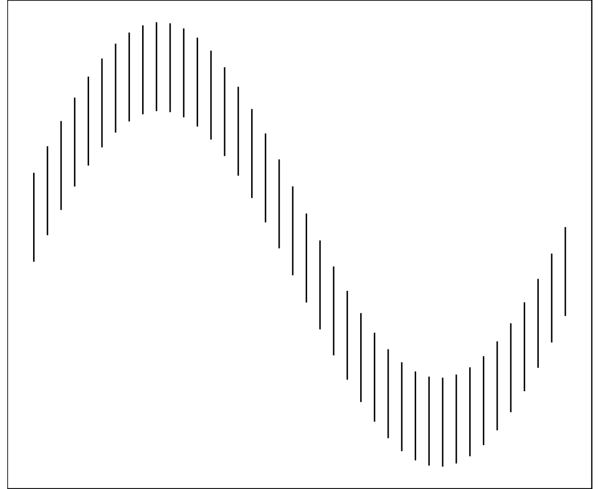

Example of the Sine Illusion
========================================================
8-hour Average Ozone Levels in Houston, TX by temperature at Hobby Airport

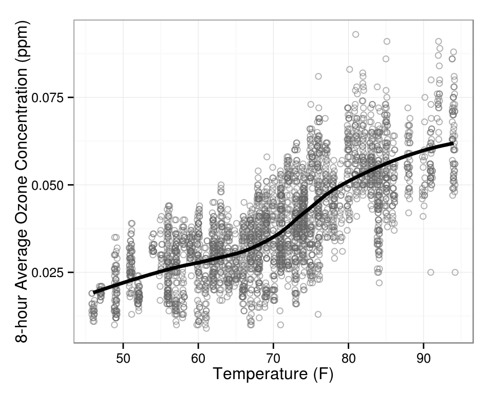

Explaining the Illusion
========================================================
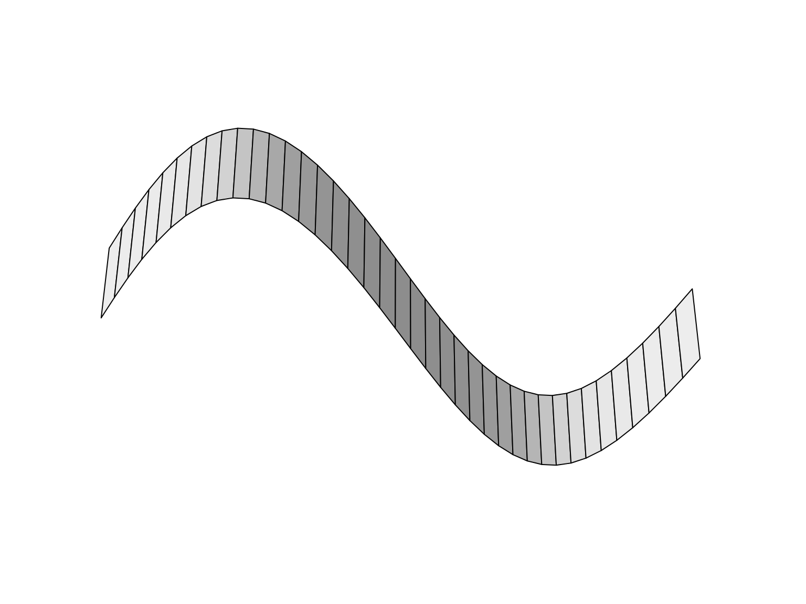
Perspective plot of a three-dimensional image similar to the sine illusion

Explaining the Illusion
========================================================
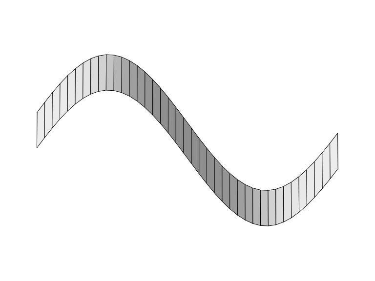
Perspective plot of the same data, with a vanishing point closer to infinity

Explaining the Illusion
========================================================
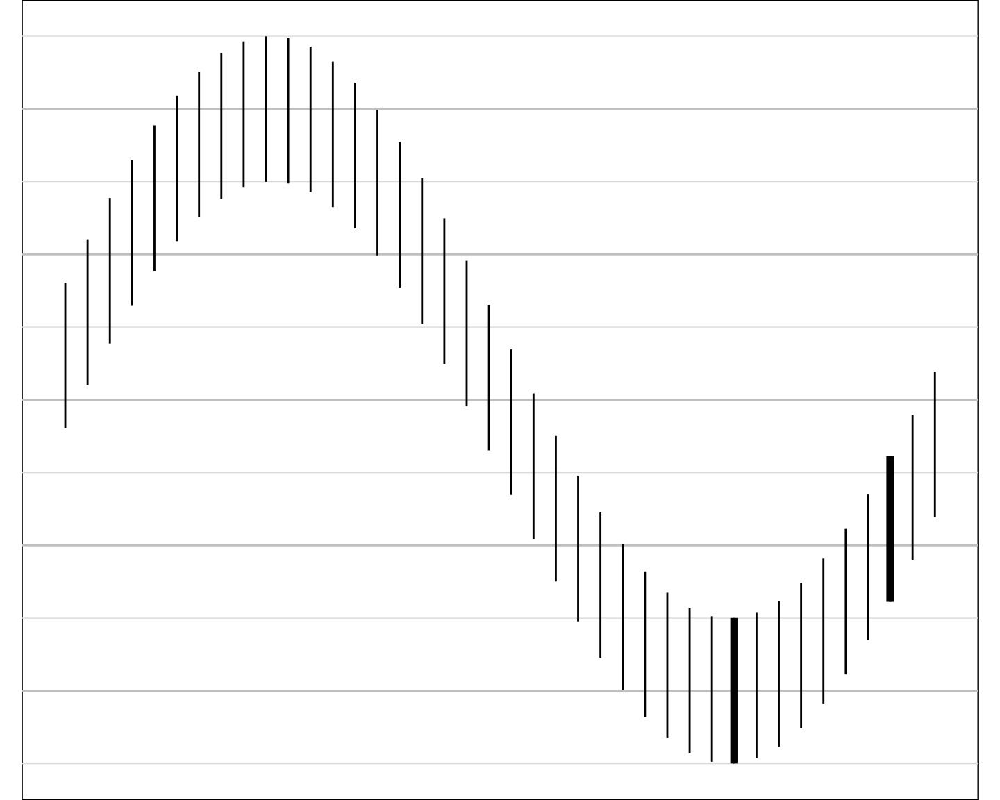
The illusion doesn't disappear with grid lines, but does disappear when the context is removed. 

Cleveland and McGill (1984) demonstrated that we can compare the length of two lines accurately; Day and Stecher (1991) showed that the illusion persists if there is curvature in the underlying function. 

Geometry of the Sine Illusion
========================================================
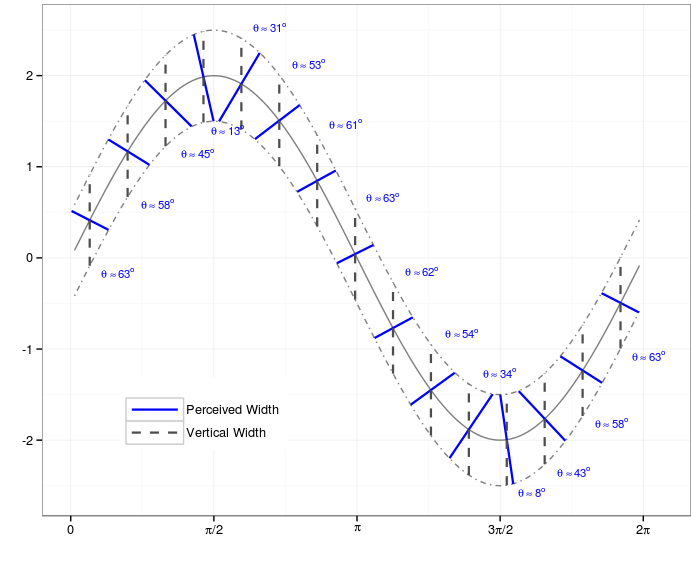
 
Geometry of the Sine Illusion
========================================================
- We perceive the orthogonal width of the implied surface
- The orthogonal width is a function of the x and y range as well as the aspect ratio of the plot. 
- The perceived orthogonal width is also a function of the slope of the line tangent to the underlying function curve. 

Correcting the Illusion
=======================================================
- Remove the underlying function (plot the curve and the residuals separately)
- Change the plotted line length (or spread) so that the **perceived** orthogonal width corresponds to the **original** (data) line length
- Reparameterize the x-axis in terms of the slope, so that the absolute slope doesn't change

Correcting the Illusion 
=======================================================
## Trend Removal
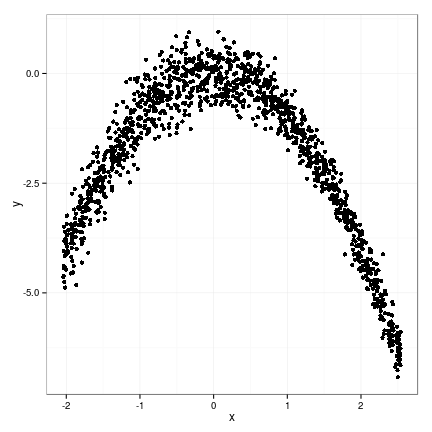

Correcting the Illusion
=======================================================
## Trend Removal
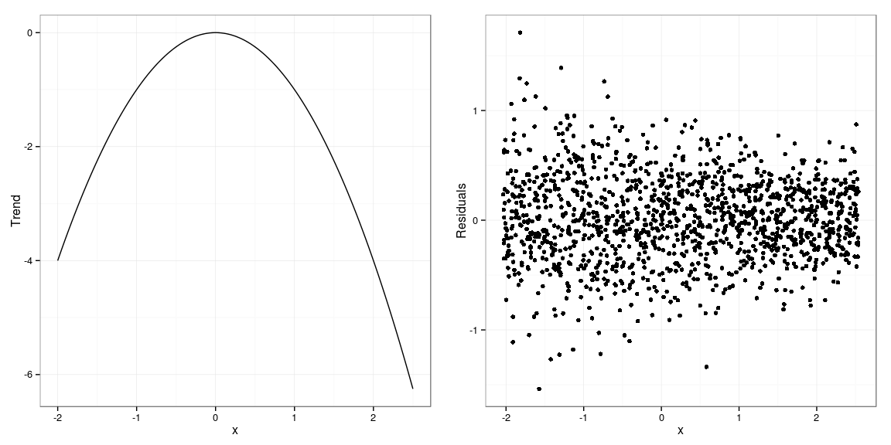

Correcting the Illusion
=======================================================
## X-axis Transformation

Let $a$ and $b$ be the minimum and maximum of the $x$-range under consideration. Then for any value $x \in (a,b)$ the following transformation results in a function with constant absolute slope:  
$$
(f \circ T)(x) = a + (b-a)\left(\int_{a}^x |f^\prime(z)| dz\right)\left/\left(\int_{a}^{b}|f^\prime(z)| dz\right)\right.
$$

Correcting the Illusion
=======================================================
## X-axis Transformation
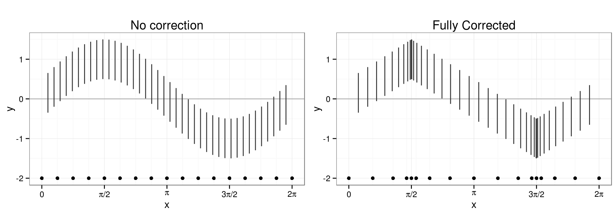

Correcting the Illusion
=======================================================
## X-axis Transformation
The transformation does not have to be fully weighted - we can introduce a shrinkage factor $w \in (0,1)$ that allows a less extreme approach to counteracting the illusion as: 

$$(f \circ T_w)(x) = (1-w) \cdot x + w \cdot (f \circ T)(x)$$

Note that for $w=1$ the $x$-transformation is complete, while smaller values of $w$ indicate a less severe adjustment against the sine illusion.  Under  weaker transformations, the data more closely reflect the original function $f(x)$. 

Correcting the Illusion
=======================================================
## X-axis Transformation
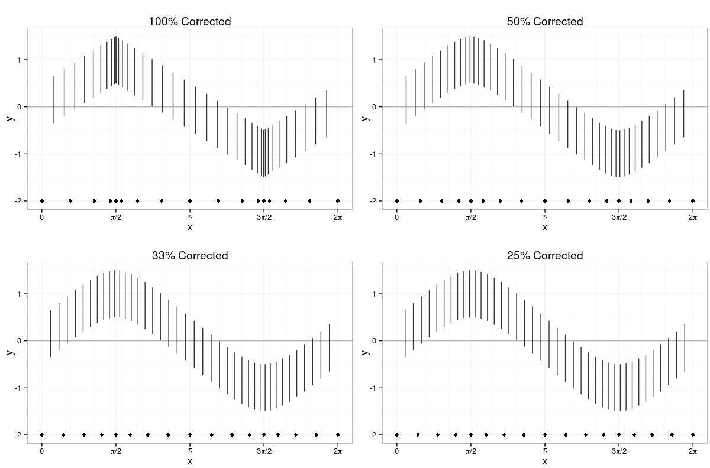

Correcting the Illusion
=======================================================
## Y-axis Transformation
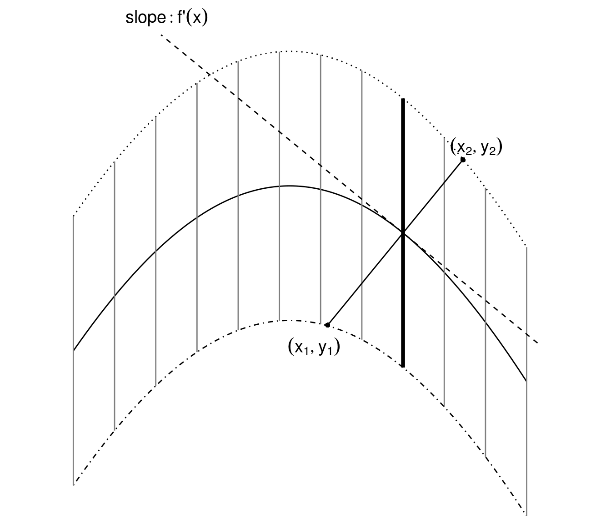

Correcting the Illusion
=======================================================
## Y-axis Transformation
The function describing the orthogonal line through $(x_o, f(x_o))$ is given in point-vector form as 
$$
{x_o \choose f(x_o)} + \lambda {f^\prime(x_o) \choose 1}, 
$$
for any real-valued $\lambda$.

Correcting the Illusion
=======================================================
## Y-axis Transformation
The advantage of using point vector form is that it allows us to solve for parameter $\lambda$ easily, which gives us easy access to the extant (half) widths,  as: 
$$
|\lambda| \sqrt{1 + f^\prime(x_o)^2}.
$$
This equation describes the quantity that we perceive rather than the quantity that we want to display ($\ell/2$)

Correcting the Illusion
=======================================================
## Y-axis Transformation
The general correction factor is thus
$$
 \ell/2 \cdot \left(|\lambda| \sqrt{1 + f^\prime(x_o)^2}\right)^{-1}.
$$

This yields two solutions: one for positive, one for negative values of $\lambda$ corresponding to upper and lower (half) extant width.

Correcting the Illusion
=======================================================
## Y-axis Transformation

In order to get  actual numeric values for $\lambda$, we need to find end points $f_1$ and $f_2$. This system of equations provides solutions for those points: 
$$
 x - x_o = \lambda f^\prime(x_o)
$$
$$
 f(x) - f(x_o) = -\lambda \pm \ell/2
$$

Solving these equations requires numerical optimization; thus, we will use taylor series to simplify the optimization process. 

Correcting the Illusion
=======================================================
## Y-axis Transformation
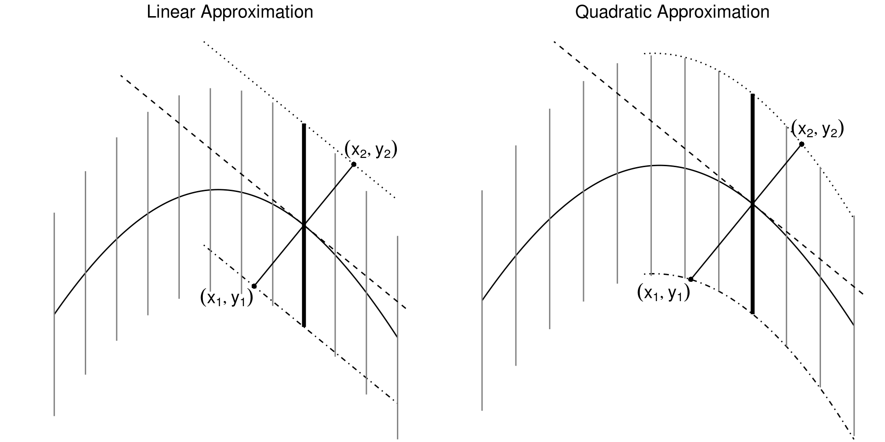

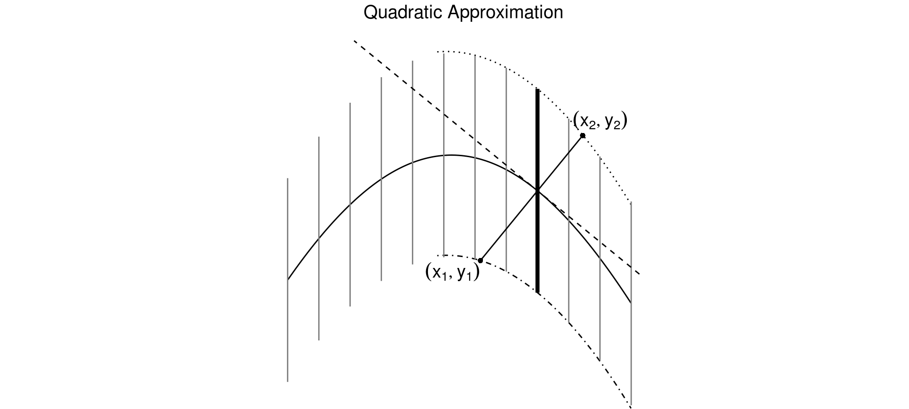

Correcting the Illusion
=======================================================
## Y-axis Transformation
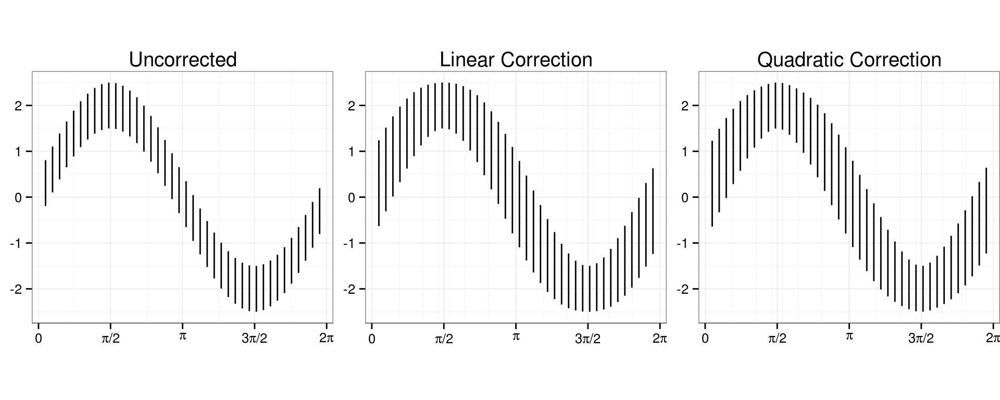

Correcting the Illusion
=======================================================
The y-axis transformation can be weighted in the same manner as the x-axis transformation. 

A [Shiny applet](https://srvanderplas.shinyapps.io/SineIllusionDemo) was created to explore the effect of weight on both x and y corrections. 

User Testing
=======================================================
**Goal** \:  Determine the strength of the Sine Illusion by measuring how much correction is required for viewers to say that the lines are of equal length. 

A different [Shiny applet](http://glimmer.rstudio.com/srvanderplas/SineIllusionShiny/) was created to allow users to manipulate the stimuli using fine-grained adjustments to the weight value. 

User Testing
=======================================================
Participants were recruited using Amazon Mechanical Turk and [Reddit](http://reddit.com/r/samplesize). 

Users could manipulate the weight value presented using -/+ buttons, until they were satisfied that the lines were of equal length. The trial was finished when they selected the 'submit' button. 

User Testing
=======================================================
### Data Collection
- User identification information: a 'fingerprint' consisting of hashed browser version, operating system, addons, screen resolution, and IP address was used to identify unique users
- IP address localization (34.45.38.XX) provided location information
- Every user interaction was recorded with a timestamp
- Trial finished when user clicked either 'submit' or 'skip' to opt-out of the trial.

User Testing
=======================================================
### Experiment Design
- 12 (or more) trials, 6 of each correction type

  - Each user completed trials starting at 0 and 1 for both correction types
  - Additional trials were selected using starting weights between 0.25 and 0.75, with point density highest around 0.6
  
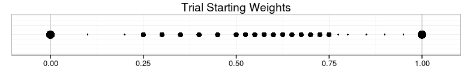

Data Inclusion Criteria
=======================================================
- Trial recorded at least two user interactions:   
The user must adjust the weight value at least once and then click the submit button. 
- User completed at least 4 trials
- User selected a weight value that was not severely over-corrected or under corrected (i.e. weight value selected was plausible)

Data Inclusion Criteria
=======================================================
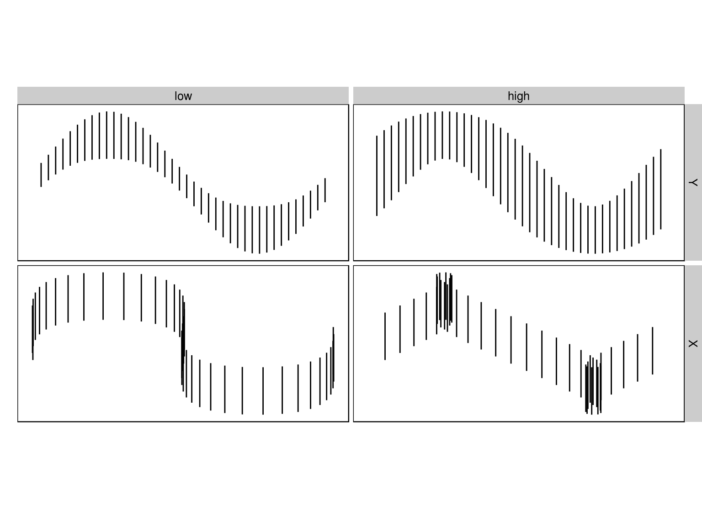

Results
=======================================================
Once exclusion criteria were applied, our data consisted of 125 participants who completed 1210 valid trials. 

Psychophysics Model
=======================================================
Let $\gamma_X$ represent the optimal weight value for the $X$-correction, and $\gamma_Y$ represent the optimal weight value for the $Y$ correction. 

$\gamma_\ast = \frac{1}{2}(w_0 + w_1)$

where $w_0$ is the preferred weight when starting at 0, and $w_1$ is the preferred weight when starting at 1. 

Psychophysics Model
=======================================================
### Psychophysics Model
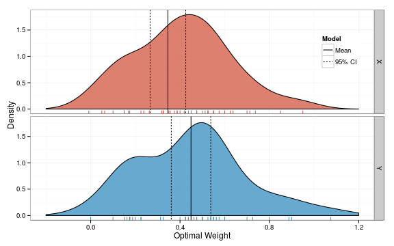

Random Effects Model
=======================================================
<ul>
<li>$W_{ij}$ the final adjustment to weight by participant $i$ on trial $j$</li>  $$1 \le i \le 125, 1 \le j \le n_i$$ 
<li>$T(i,j)$  the correction type, where $T(i,j) \in  \{X, Y\}$</li> 
<li>Starting weight $X_{ij}$</li>  
<li>$\alpha_\ast$, the lowest acceptable weight value for correction type $\ast$</li>
<li>$\beta$, the width of the interval of acceptable weight values</li>
<li>Participant-level random intercept $\gamma_{i, \ast}$</li>
</ul>

Random Effects Model
=======================================================
$$
W_{ij} = \alpha_{T(i,j)} + \beta X_{ij} + \gamma_{i, T(i,j)} + \epsilon_{ij}$$

$$\gamma_{iX} \stackrel{\text{ i.i.d.}}{\sim} N(0, \eta_X^2) \ \ \ \ \ \ \ \ \gamma_{iY} \stackrel{\text{ i.i.d.}}{\sim} N(0, \eta_Y^2) $$

$$\epsilon_{ij} \stackrel{\text{ i.i.d.}}{\sim} N(0, \sigma^2)   \ \ \ \ \ \ \ \ \text{Cov}(\gamma, \epsilon) = 0$$

The range of acceptable values is 

$$(\alpha_\ast, \alpha_\ast + \beta)$$

Random Effects Model
=======================================================
$$
W_{ij} = \alpha_{T(i,j)} + \beta X_{ij} + \gamma_{i, T(i,j)} + \epsilon_{ij}$$

$$\gamma_{iX} \stackrel{\text{ i.i.d.}}{\sim} N(0, \eta_X^2) \ \ \ \ \ \ \ \ \gamma_{iY} \stackrel{\text{ i.i.d.}}{\sim} N(0, \eta_Y^2) $$

$$\epsilon_{ij} \stackrel{\text{ i.i.d.}}{\sim} N(0, \sigma^2)   \ \ \ \ \ \ \ \ \text{Cov}(\gamma, \epsilon) = 0$$

We can compare this model to the psychophysics model using the midpoint of this interval,  $$\alpha+\beta/2$$

Random Effects Model
=======================================================
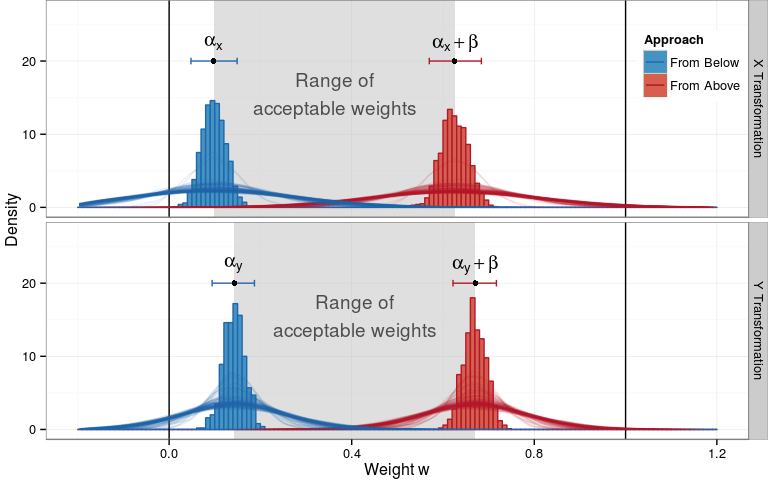

Conclusions
=======================================================
- Either correction is preferrable to an uncorrected graph  

- Corrections do not have to be fully applied to break the illusion's power  

- The sine illusion is strong enough to make participants think that lines of unequal length are equal

Visual Aptitude and Graphical Inference
========================================================
type:sub-section

Salience of Graph Features
========================================================
type:sub-section

Timeline
========================================================
type:sub-section
**Sine Illusion:**
  - Paper submitted to JCGS in Oct 2013, revision submitted in March 2014
  - Second paper will likely be submitted to Chance
    - Different user study, same basic conclusion
  
Timeline
========================================================
type:sub-section
**Visual Aptitude:**
  - Pilot study in Feb 2014
  - Data collection started in April 2014
  - Second round of data collection this summer
  - Paper to be written by September 2014
  
Timeline
========================================================
type:sub-section
**Graph Feature Hierarchy:**
  - Pilot study in Feb 2014
  - Data collection (Amazon Turk) in September 2014
  - Paper written by November 2014

Timeline
========================================================
type:sub-section
Goal \: Defend in January or February 2015 
